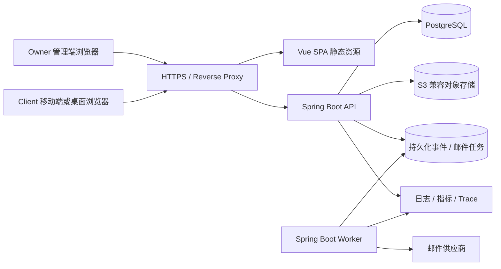
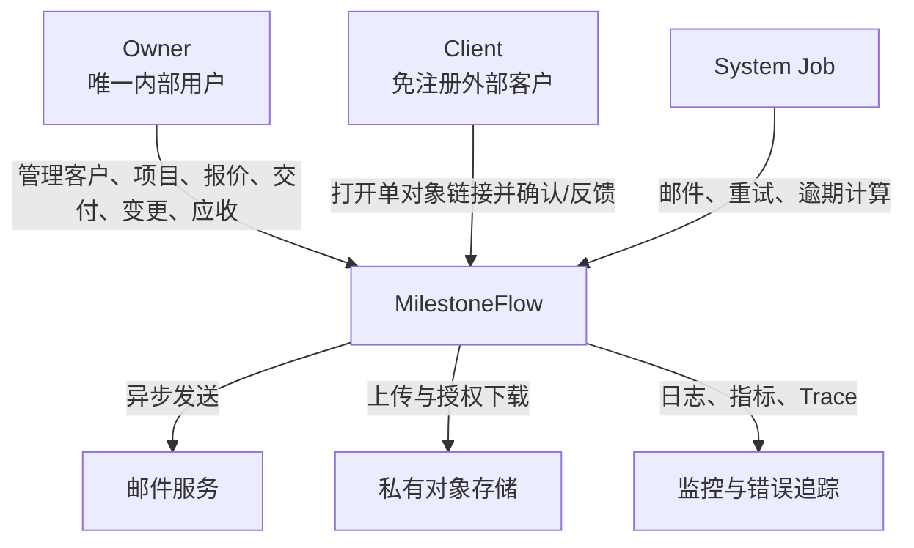
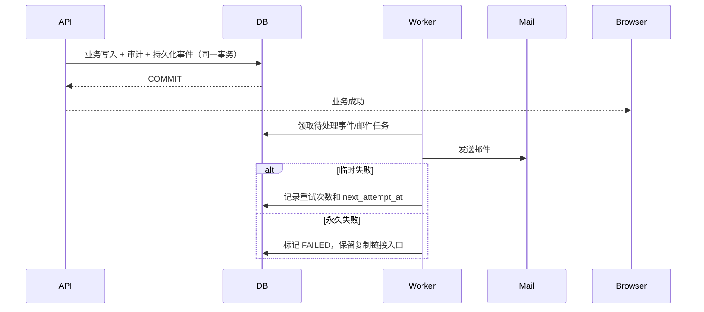
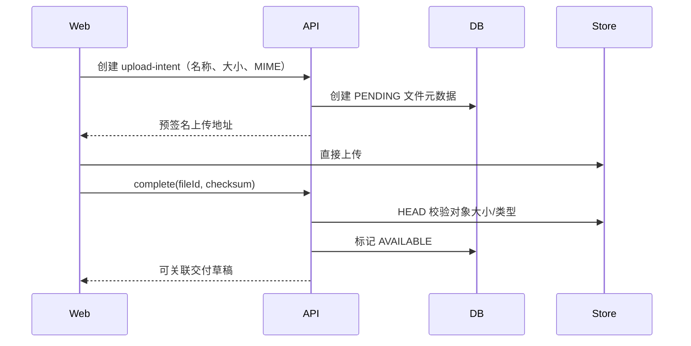

# 《MilestoneFlow Pilot MVP V0.1 系统总体架构设计》

## 1. 文档信息

| 字段 | 内容 |
|---|---|
| 文档编号 | MF-ARCH-001 |
| 版本 | V0.1 |
| 状态 | Architecture Baseline Candidate |
| 编制日期 | 2026-06-06 |
| 输入基线 | `01_Pilot_MVP_V0.1_PRD_基线.md`、`02_用户故事与验收标准.md`、`03_核心业务流程说明.md`、`04_需求追踪矩阵.md` |
| 适用范围 | Pilot MVP V0.1 设计、开发、测试、部署与架构评审 |

## 2. 架构目标

MilestoneFlow V0.1 不是通用项目管理系统，而是面向固定价项目服务者的“范围—报价—交付—验收—变更—应收”商业控制平台。架构必须优先保证以下业务不变量：

1. 已发布报价、交付和变更版本不可覆盖。
2. 客户确认前，商业基线、项目金额、交付日期和应收不得变化。
3. 报价确认、验收、变更确认、付款记录和提醒必须幂等。
4. 每一条内部业务数据都属于唯一 `workspace_id`。
5. 公开链接只能授权一个已发布业务对象及其必要文件。
6. 邮件失败不得回滚已成功的业务事务。
7. 金额使用十进制定点数，时间存 UTC、按工作空间时区解释。
8. 关键状态变化、操作者、来源和请求编号必须可追溯。

## 3. 架构风格结论

### 3.1 采用：模块化单体 + 独立异步 Worker

V0.1 使用一个代码仓库、一个后端应用、一个 PostgreSQL 数据库，按业务领域划分模块；API 进程和异步 Worker 使用同一构建产物、不同运行 Profile。



### 3.2 不采用微服务的原因

- 核心闭环存在大量需要强一致的事务边界。
- Pilot 团队规模和流量不需要独立扩容每个业务域。
- 微服务会提前引入分布式事务、消息幂等、服务发现、链路追踪和版本协调成本。
- 模块化单体保留未来拆分可能，但不在 V0.1 为假设性规模付费。

### 3.3 进程划分

| 进程 | 职责 | 是否可独立扩容 |
|---|---|---|
| `milestoneflow-api` | REST API、认证、授权、业务事务、公开链接交换、文件签名 | 是 |
| `milestoneflow-worker` | 邮件任务、失败重试、逾期扫描、事件投影维护 | 是 |
| `milestoneflow-web` | Vue 编译后的静态资源 | 由反向代理/CDN 承载 |

## 4. 技术栈基线

### 4.1 前端

| 类别 | 选择 | 说明 |
|---|---|---|
| 框架 | Vue 3 + Composition API | 管理端和公开端共享工程、分路由布局 |
| 语言 | TypeScript 5.x | API DTO、状态和组件 Props 强类型 |
| 构建 | Vite 8.x | Node.js 22.12+，锁定依赖和构建产物 |
| 路由 | Vue Router | 管理端、认证页、公开页分区 |
| 状态 | Pinia + Query Cache | Pinia 只放会话/UI 状态，服务端数据由查询缓存管理 |
| 表单 | Schema 校验库 + 服务端校验 | 前端校验提升体验，后端校验为最终准则 |
| UI | 管理端组件库 + 自定义公开页组件 | 公开页移动端优先，避免直接复用复杂后台布局 |
| 测试 | Vitest、Vue Test Utils、Playwright | 单元、组件、E2E 分层 |

### 4.2 后端

| 类别 | 选择 | 说明 |
|---|---|---|
| 语言 | Java 21 | 长期支持版本，统一开发和生产运行时 |
| 框架 | Spring Boot 3.5.x，初始锁定 3.5.14 | 优先成熟生态；Patch 版本可升级 |
| 模块化 | Spring Modulith 1.4.x | 验证模块边界、模块测试、持久化事件 |
| Web | Spring MVC | 当前业务以数据库事务和文件签名为主，不采用响应式栈 |
| 安全 | Spring Security | 认证、CSRF、请求授权、密码编码、登录限流集成 |
| ORM | Spring Data JPA / Hibernate | 聚合写模型；复杂工作台查询使用显式 SQL/Projection |
| 数据迁移 | Flyway | 所有结构和种子枚举变更版本化 |
| API 文档 | OpenAPI 3.1 | 契约生成、Mock、联调和测试输入 |
| 构建 | Maven Wrapper | 固定 Maven 版本，CI 与本地一致 |
| 测试 | JUnit 5、AssertJ、Testcontainers、MockMvc | PostgreSQL 真容器集成测试为门禁 |

### 4.3 数据与基础设施

| 类别 | 选择 | 说明 |
|---|---|---|
| 主数据库 | PostgreSQL 17.x，初始锁定 17.10 | 使用事务、约束、JSONB、索引与成熟运维生态 |
| 缓存 | V0.1 不引入 Redis；本地 Caffeine 仅缓存非关键数据 | 幂等、租户边界和状态不依赖本地缓存 |
| 文件 | S3 兼容私有对象存储 | 预签名上传/下载，数据库只保存元数据和对象键 |
| 邮件 | Provider Adapter | 供应商可替换；发送由 Worker 执行 |
| 反向代理 | Caddy 或 Nginx | HTTPS、静态资源、请求体限制、安全响应头 |
| 容器 | Docker / Docker Compose | 开发、预发布和 Pilot 生产环境一致化 |
| 可观测性 | JSON 日志、Micrometer、OpenTelemetry | 关联 `request_id`、trace、业务对象 ID |

## 5. 系统上下文



## 6. 后端逻辑分层

每个业务模块内部采用轻量六边形结构，不允许 Controller 直接操作 Repository。

```text
module
├── api/                # Controller、Request/Response DTO、API 映射
├── application/        # Command、Query、Use Case、事务边界
├── domain/             # Aggregate、Value Object、Domain Service、Domain Event
└── infrastructure/     # JPA、SQL、外部 Provider Adapter
```

共享代码仅允许放入：

- `sharedkernel.money`：Money、Currency、Decimal 规则；
- `sharedkernel.time`：Clock、WorkspaceTime；
- `sharedkernel.id`：ID 类型；
- `sharedkernel.error`：错误码接口；
- `sharedkernel.security`：调用者上下文的抽象；
- `sharedkernel.events`：事件基础接口。

不得将业务实体、Repository 或万能工具类放入共享层。

## 7. 核心数据设计原则

### 7.1 多租户

- 业务表必须包含不可为空的 `workspace_id`。
- 所有 Repository 方法必须显式接收 `WorkspaceId`。
- 父子实体使用 `(workspace_id, parent_id)` 组合外键，数据库层阻止跨租户引用。
- 唯一约束默认包含 `workspace_id`。
- 内部 API 从已认证会话解析工作空间，不接受客户端任意指定可信工作空间。
- V0.1 使用“应用强制隔离 + 数据库组合约束 + 自动化越权测试”，不启用 PostgreSQL RLS；RLS 作为后续防御增强 ADR 保留。

### 7.2 不可变版本

报价、交付、变更均使用“可编辑草稿 + 发布快照”模型：

```text
QuoteDraft / DeliveryDraft / ChangeDraft
    ↓ publish
QuoteVersion / DeliveryVersion / ChangeVersion  (append-only)
```

发布版本：

- 不提供 UPDATE/DELETE 业务接口；
- 数据库触发器或约束阻止发布后修改；
- 新内容通过递增版本号创建；
- `SUPERSEDED`、`REVOKED` 等只改变独立状态记录，不覆盖版本正文；
- 文件引用进入版本快照后不可物理删除。

### 7.3 当前商业基线

商业基线不是前端拼接结果，而是后端生成的不可变快照：

```text
已确认 QuoteVersion
+ 已确认 ChangeVersion 序列
= CommercialBaselineSnapshot N
```

确认变更的单一数据库事务必须完成：

1. 锁定当前项目与基线版本；
2. 校验变更仍针对当前基线；
3. 创建新基线快照；
4. 更新项目汇总投影；
5. 创建或调整应收；
6. 写审计事件；
7. 写持久化领域事件；
8. 提交事务。

任何一步失败则整体回滚。

### 7.4 金额与时间

- 数据库金额使用 `numeric(19,4)`，业务展示按币种小数位格式化。
- Java 使用 `BigDecimal`，禁止 `double/float`。
- API 金额以十进制字符串传输，例如 `"1250.00"`。
- 货币使用 ISO 4217 三字母代码。
- 审计和技术时间使用 `timestamptz`、UTC。
- 业务到期日保存 `date`，逾期判断以工作空间时区的“当地日期结束”执行。

## 8. 关键一致性机制

### 8.1 强一致事务

必须在同一数据库事务内完成：

- 报价确认 → 确认结果、首个商业基线、应收草稿、审计、事件；
- 交付验收通过 → 验收结论、里程碑状态、应收激活、审计、事件；
- 变更确认 → 新基线、金额/日期投影、应收、审计、事件；
- 付款记录/作废 → 付款记录、余额、应收状态、审计、事件。

### 8.2 幂等

高风险写操作要求 `Idempotency-Key`：

- 公开报价确认/拒绝；
- 公开交付验收；
- 公开变更确认/拒绝；
- 付款记录与付款作废；
- 提醒发送；
- 发布操作。

幂等记录包含调用范围、操作名、Key、请求哈希、处理状态、响应快照和过期时间。相同 Key 与相同请求返回首次结果；相同 Key 与不同请求返回冲突。

### 8.3 并发控制

- 草稿、项目、里程碑和应收使用乐观锁 `version`。
- 确认类操作对目标行使用条件更新或短事务行锁。
- 数据库唯一约束作为最后防线，例如每个版本只能有一个最终客户结论。
- 状态机转换统一由领域方法执行，不允许 Controller 直接设置状态。

### 8.4 异步可靠性

业务事务提交时持久化领域事件；Worker 后续处理邮件和非关键投影。



## 9. 公开链接架构

### 9.1 能力令牌

- 每次签发使用至少 32 字节密码学随机数。
- 数据库只保存 SHA-256 哈希、对象类型、对象 ID、状态、有效期和撤销信息。
- 原始令牌仅在签发响应或 Worker 发送邮件的内存中出现一次。
- “复制链接”会签发新的链接记录，不从数据库恢复旧令牌。
- 新版本发布时批量将旧版本链接标记为 `SUPERSEDED`。

### 9.2 令牌交换

推荐公开 URL 将令牌放在 Fragment，前端首次加载后通过 POST 交换成短时、HttpOnly 的公开会话 Cookie，并立即从地址栏移除令牌。公开会话绑定：

- `public_link_id`；
- 业务对象类型和版本 ID；
- 允许动作集合；
- 到期时间；
- 可选客户端指纹摘要。

这样后续 API 和文件下载不再携带原始令牌，也降低反向代理日志、Referer 和第三方脚本泄漏风险。

## 10. 文件架构



下载必须通过 API 授权后生成短时预签名地址；对象桶不公开。公开会话只能下载其绑定交付版本引用的文件。

## 11. 前端架构

### 11.1 路由区域

```text
/auth/*             注册、验证、登录、重置
/app/*              Owner 管理端
/public/*           Client 公开页面壳
/public-result/*    统一成功、已处理、失效状态
```

### 11.2 状态规则

- 认证状态：Pinia，仅保存非敏感用户摘要；令牌保存在 HttpOnly Cookie。
- 服务端状态：Query Cache，写成功后按资源键失效。
- 表单草稿：本地组件状态，必要时用 sessionStorage 做失败恢复；不得保存令牌和敏感全文。
- API DTO：从 OpenAPI 生成类型，禁止手工复制重复模型。
- 管理端桌面优先；公开页以 360px 宽度为最低测试基线。

## 12. 模块间通信规则

- 强一致同一聚合内使用直接方法调用。
- 跨模块只依赖对方公开 Application API 或领域事件。
- 禁止跨模块访问 JPA Entity 和 Repository。
- 通知、审计、工作台投影通过事件消费。
- Dashboard 可调用只读 Query Port，但不得反向修改业务模块。

## 13. 扩展与演进

### 13.1 V0.1 扩容顺序

1. 提升单实例资源与数据库索引；
2. API 与 Worker 分容器；
3. API 多实例，Worker 使用数据库抢占锁；
4. 引入 Redis 处理分布式限流和热点缓存；
5. 将文件、邮件等明显边界拆成独立服务；
6. 只有当团队和负载证明必要时拆分核心业务模块。

### 13.2 明确不提前实现

- 通用任务 CRUD、甘特图、工时；
- 多成员复杂 RBAC；
- 多工作空间切换；
- Kafka/RabbitMQ；
- Elasticsearch；
- Kubernetes；
- 在线支付和电子签章；
- AI 自动草案。

## 14. 发布架构门禁

- Spring Modulith/ArchUnit 模块依赖验证通过。
- Testcontainers PostgreSQL 集成测试覆盖事务、唯一约束、触发器和时区。
- 所有公开链接失效场景和跨对象文件访问测试通过。
- 并发重复确认、付款和提醒测试结果只有一个业务副作用。
- 邮件 Provider 故障时业务对象仍保持成功状态。
- 数据库迁移可前滚，备份恢复演练通过。
- 核心 API P95、公开确认耗时和错误率进入监控面板。

## 15. 需求映射摘要

| 架构能力 | 覆盖需求 |
|---|---|
| 模块化单体与事务边界 | BASE、QUOTE、ACC、CR、REC、PAY |
| 工作空间强制隔离 | WS、CLIENT、PROJ、PUBLIC、FILE |
| 版本快照与不可变约束 | QUOTE、DEL、CR、AUDIT |
| 能力令牌与公开会话 | PUBLIC、QUOTE-003、ACC、CR-002 |
| 持久化事件与 Worker | NOTIF、REM、AUDIT、DASH |
| 幂等与乐观锁 | ERR、PUBLIC、PAY、REM |
| S3 私有对象存储 | FILE、DEL |
| 统一可观测性 | AUDIT、ERR、NFR |
