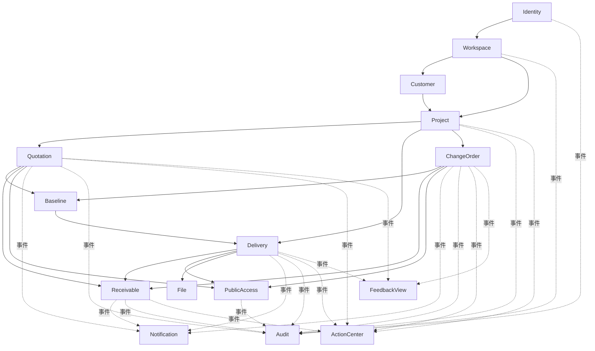
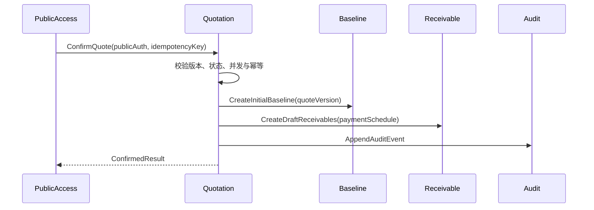

# 《MilestoneFlow Pilot MVP V0.1 模块划分与依赖关系》

## 1. 文档信息

| 字段 | 内容 |
|---|---|
| 文档编号 | MF-ARCH-MOD-001 |
| 版本 | V0.1 |
| 目标 | 冻结模块边界、职责、依赖方向和关键聚合 |

## 2. 模块划分原则

1. 按业务能力而非数据库表或页面划分。
2. 模块拥有自己的实体、Repository、状态机和错误码。
3. 模块之间只通过公开 Application API、ID 或事件协作。
4. 跨模块强一致越少越好；确实属于一个业务事务的流程由编排应用服务负责。
5. Dashboard、审计和通知是消费型模块，不反向控制核心业务。
6. V0.1 的“任务”指由业务状态派生的下一动作，不建设通用任务管理。
7. V0.1 的“反馈”指报价留言、交付验收反馈和变更留言，不建设即时聊天或通用评论系统。

## 3. 模块总览

| 模块 | 主要职责 | 核心聚合/记录 | V0.1 边界 |
|---|---|---|---|
| Identity | 注册、验证、登录、刷新、退出、密码重置、会话撤销 | User、Credential、AuthSession、VerificationToken | 仅邮箱密码登录 |
| Workspace | 工作空间配置、唯一 Owner、租户上下文 | Workspace、WorkspaceMembership | 单工作空间、单 Owner |
| Customer | 客户与主要联系人 | Client、PrimaryContact | 不含 CRM、标签、导入 |
| Project | 项目生命周期、归档、汇总状态 | Project | 不含通用任务/工时 |
| Quotation | 报价草稿、发布版本、客户结论 | QuoteDraft、QuoteVersion、QuoteDecision | 发布版本不可变 |
| Baseline | 当前商业基线和历史快照 | CommercialBaselineSnapshot | 仅由已确认报价/变更生成 |
| Delivery | 里程碑、交付版本、验收结论 | Milestone、DeliveryDraft、DeliveryVersion、AcceptanceDecision | 版本级验收 |
| ChangeOrder | 正式需求变更草稿、版本、客户结论 | ChangeDraft、ChangeVersion、ChangeDecision | 确认前不生效 |
| Receivable | 应收、付款记录、作废、逾期、提醒 | Receivable、PaymentRecord、Reminder | 不处理真实资金 |
| PublicAccess | 公开能力链接、令牌交换、公开会话、访问记录 | PublicLink、PublicSession、PublicAccessLog | 只授权单一对象 |
| File | 上传意图、文件元数据、版本引用、授权下载 | FileAsset、FileReference | 仅交付文件 |
| Notification | 邮件任务、重试、供应商适配 | EmailTask、EmailAttempt | 无站内通知中心 |
| Audit | 不可变审计和项目时间线 | AuditEvent | 普通 API 不可改删 |
| ActionCenter | 待确认、待验收、待付款、已逾期等下一动作投影 | ActionItemProjection | 系统派生、不可自由创建 |
| FeedbackView | 跨报价/交付/变更的反馈只读聚合 | FeedbackProjection | 原始反馈仍归所属业务模块 |
| Scheduler | 逾期计算、任务领取、重试调度 | JobLease、JobRun | Worker 内部能力 |

## 4. 模块依赖图



箭头表示“上游能力被下游使用”。虚线表示异步或投影事件，不允许反向命令调用。

## 5. 核心模块详细设计

### 5.1 Identity

**公开能力：**

- `RegisterUser`
- `VerifyEmail`
- `Login`
- `RefreshSession`
- `Logout`
- `RequestPasswordReset`
- `ResetPassword`
- `ResolveAuthenticatedPrincipal`

**业务规则：**

- 邮箱规范化后全局唯一。
- 密码重置、账号禁用和显式全端退出会撤销全部会话族。
- 登录失败信息不区分邮箱不存在和密码错误。
- 未验证邮箱可登录受限态，但不能签发客户公开链接。

### 5.2 Workspace

**公开能力：**

- `CreateWorkspace`
- `GetCurrentWorkspace`
- `UpdateWorkspaceSettings`
- `RequireOwner`

**业务规则：**

- V0.1 一个用户只能拥有一个活跃工作空间。
- 一个工作空间只允许一个内部 Owner。
- 默认币种和时区创建后可修改，但历史业务记录保留原货币和解释规则。

### 5.3 Customer

**公开能力：** 创建、修改、搜索、归档、恢复、按租户解析客户。

**业务规则：**

- 归档客户不可创建新项目。
- 已存在业务历史的客户不可物理删除。
- 主要联系人邮箱是业务通知目标，不代表系统账号。

### 5.4 Project

**职责：** 项目状态机、归档只读、基础日期和币种、商业汇总投影入口。

**不负责：** 报价正文、交付正文、付款明细、文件字节。

**状态转换：**

```text
DRAFT
→ PENDING_QUOTE_CONFIRMATION
→ CONFIRMED
→ IN_PROGRESS
→ PENDING_ACCEPTANCE
→ COMPLETED
→ ARCHIVED
```

`PAUSED`、`CANCELLED` 为受控分支。归档后所有业务写操作由统一 Guard 拒绝。

### 5.5 Quotation

**聚合拆分：**

- `QuoteDraft`：可编辑，具有乐观锁；
- `QuoteVersion`：发布快照，不可变；
- `QuoteDecision`：客户确认、拒绝和留言的最终记录；
- `QuoteLinkPolicy`：有效期、撤销和版本替代规则。

**发布事务：**

1. 校验范围、非范围、金额、付款计划和日期；
2. 锁定项目当前报价序号；
3. 创建新 `QuoteVersion`；
4. 替代旧待确认版本；
5. 更新项目状态；
6. 写审计和持久化事件。

### 5.6 Baseline

**职责：** 保存可追溯的商业事实快照，不提供自由编辑。

**快照组成：**

- 有效范围与非范围；
- 交付物与验收标准；
- 修改次数；
- 总金额、付款计划；
- 交付日期；
- 每一项事实的来源版本。

**依赖约束：** Baseline 只能读取 Quotation 和 ChangeOrder 的已确认版本，不允许 Quotation/ChangeOrder 反向修改已有快照。

### 5.7 Delivery

**包含：** 里程碑、交付草稿、交付版本、验收结论、修改请求。

**关键规则：**

- 里程碑只有在项目存在当前商业基线时创建。
- 提交交付前所有文件必须为 `AVAILABLE`。
- 新交付生成 V2/V3，不覆盖 V1。
- 验收通过后结论不可修改；请求修改/拒绝必须包含原因。
- 并发的不同验收结论只允许第一个合法事务生效。

### 5.8 ChangeOrder

**职责：** 记录新增、修改、删除、仍不包含以及费用/工期/日期/付款影响。

**关键规则：**

- 发布时绑定一个 `base_baseline_id`。
- 客户确认时若当前基线已变化，则返回 `BASELINE_STALE`，要求重新评估并发布新版本。
- 确认事务创建下一版基线，不更新旧快照。

### 5.9 Receivable

**包含：**

- `Receivable`：来源、应收金额、已收、未收、到期日、主状态；
- `PaymentRecord`：付款事实，可作废不可删除；
- `Reminder`：预览、发送意图和结果；
- `OverdueProjection`：工作空间当地日期计算结果。

**应收来源：** 报价付款节点、里程碑验收、确认变更。来源使用类型 + ID，且必须可追溯。

### 5.10 PublicAccess

**职责：** 与具体业务域解耦处理能力令牌、失效策略、访问日志和公开会话。

```text
PublicLink
- id
- token_hash
- workspace_id
- object_type
- object_id
- allowed_actions
- status
- expires_at
- revoked_at
- superseded_at
```

PublicAccess 只返回 `PublicAuthorization`，具体业务内容由所属模块加载。它不能直接修改报价、交付或变更状态。

### 5.11 File

**职责：** 文件元数据和存储适配；不理解交付业务状态。

Delivery 通过 `FileReadPort` 校验文件状态，通过 `FileReferencePort` 建立不可删除的历史引用。

### 5.12 ActionCenter（任务模块的 V0.1 定义）

ActionCenter 不是用户创建的 Todo。它根据业务事件生成：

- 待发送报价；
- 待客户确认报价；
- 待提交交付；
- 待客户验收；
- 待客户确认变更；
- 待付款；
- 即将到期；
- 已逾期；
- 邮件失败待处理。

每个 ActionItem 包含业务对象、优先级、金额影响、建议动作和深链。源状态变化后由投影更新或关闭。

### 5.13 FeedbackView（反馈模块的 V0.1 定义）

原始反馈由所属业务模块持有：

| 反馈类型 | 所属模块 |
|---|---|
| 报价留言/拒绝原因 | Quotation |
| 交付修改请求/拒绝原因 | Delivery |
| 变更留言/拒绝原因 | ChangeOrder |

FeedbackView 只构建统一只读列表，供项目时间线和后续 Pilot 分析使用。它不允许编辑原始反馈，也不形成聊天线程。

## 6. 跨模块业务编排

### 6.1 报价确认编排



该编排由 Quotation Application Service 主持，并使用同一个数据库事务。模块间传递 DTO/ID，不传 Entity。

### 6.2 验收通过编排

Delivery 主持事务，Receivable 接收激活命令；如果应收激活失败，验收事务回滚，避免“已验收但未生成正确商业结果”。

### 6.3 变更确认编排

ChangeOrder 主持事务，Baseline 生成新快照，Receivable 创建/调整应收，Project 更新汇总投影。

## 7. 包结构建议

```text
com.milestoneflow
├── MilestoneFlowApplication.java
├── sharedkernel/
├── identity/
├── workspace/
├── customer/
├── project/
├── quotation/
├── baseline/
├── delivery/
├── changeorder/
├── receivable/
├── publicaccess/
├── fileasset/
├── notification/
├── audit/
├── actioncenter/
├── feedbackview/
└── scheduler/
```

每个模块根包中的公开类型可被依赖；`internal` 子包禁止外部模块访问。CI 使用 Spring Modulith 验证和 ArchUnit 规则阻止非法依赖。

## 8. 数据表归属示例

| 表 | 所属模块 |
|---|---|
| `app_user`, `auth_session`, `email_verification` | Identity |
| `workspace`, `workspace_membership` | Workspace |
| `client`, `client_contact` | Customer |
| `project` | Project |
| `quote_draft`, `quote_version`, `quote_decision` | Quotation |
| `commercial_baseline`, `baseline_item` | Baseline |
| `milestone`, `delivery_draft`, `delivery_version`, `acceptance_decision` | Delivery |
| `change_draft`, `change_version`, `change_decision` | ChangeOrder |
| `receivable`, `payment_record`, `reminder` | Receivable |
| `public_link`, `public_session`, `public_access_log` | PublicAccess |
| `file_asset`, `file_reference` | File |
| `email_task`, `email_attempt` | Notification |
| `audit_event` | Audit |
| `action_item_projection`, `feedback_projection` | 投影模块 |
| `idempotency_record`, `event_publication` | 基础设施 |

## 9. 禁止依赖清单

- Controller → 其他模块 Repository。
- Dashboard → 核心模块写服务。
- Notification → 修改业务状态。
- Audit → 反向调用业务模块。
- File → 绕过 Delivery 判断公开文件权限。
- PublicAccess → 读取任意 workspace 数据。
- Quotation/Delivery/ChangeOrder → 直接调用邮件供应商。
- 任何模块 → 根据前端传入 `workspace_id` 信任租户。

## 10. 模块验收标准

- 每个模块至少有一组模块集成测试。
- 依赖图与实际包依赖一致。
- 每个状态机有合法和非法转换测试。
- 每个跨模块事务有失败回滚测试。
- 每个业务事件有消费者幂等测试。
- ActionCenter 与 FeedbackView 可完全从源数据重建。
