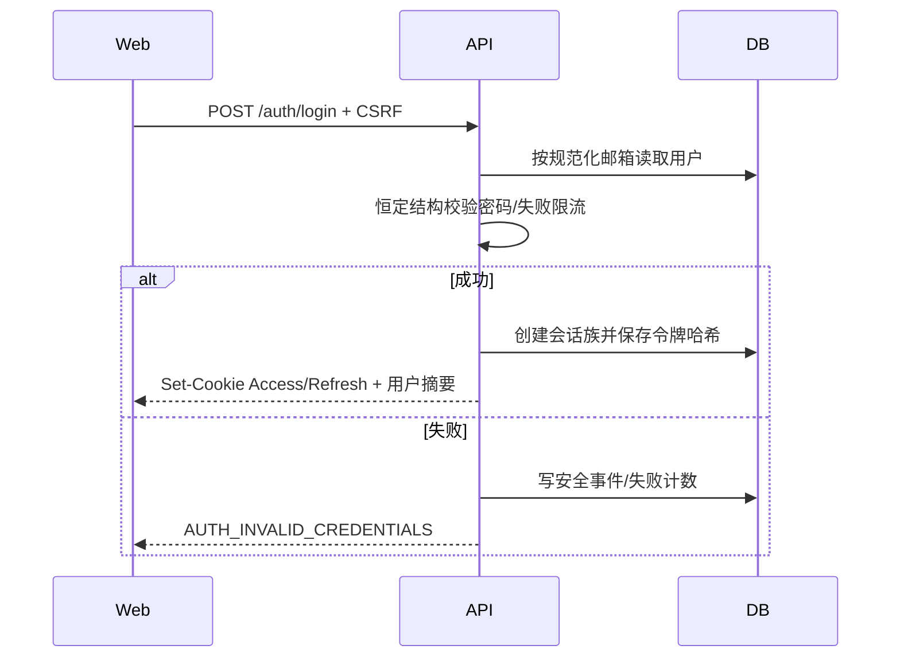
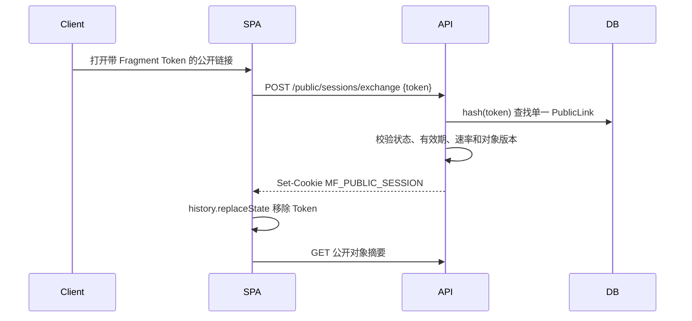

# 《MilestoneFlow Pilot MVP V0.1 认证授权设计》

## 1. 文档信息

| 字段 | 内容 |
|---|---|
| 文档编号 | MF-SEC-001 |
| 版本 | V0.1 |
| 覆盖范围 | 内部 Owner 认证、工作空间授权、公开链接、文件授权、会话撤销与安全审计 |

## 2. 安全目标

1. 内部账号凭证泄漏时，攻击面和会话持续时间受控。
2. 密码重置、账号禁用和退出后旧会话可立即失效。
3. 所有业务资源同时通过“身份、角色、工作空间、对象状态”四层校验。
4. 公开客户无需注册，但只能访问一个已发布对象及其必要文件。
5. 数据库不保存可直接使用的公开令牌、邮箱验证令牌、密码重置令牌或会话令牌。
6. 失败响应不暴露邮箱是否存在、对象是否存在、内部 ID 或状态细节。
7. 高风险动作具备 CSRF、防重放、幂等、限流和审计。

## 3. 身份与角色模型

### 3.1 主体

| 主体 | 认证方式 | 权限来源 |
|---|---|---|
| Owner | 邮箱密码 + 内部访问/刷新会话 | WorkspaceMembership=OWNER |
| Client | 公开能力令牌交换后的短时公开会话 | PublicLink.allowed_actions |
| System Job | 部署身份/进程 Profile | 内部 Job 权限，不可模拟用户 |

### 3.2 V0.1 角色

V0.1 只开放 `OWNER`，但数据库仍使用 `workspace_membership` 建模，为 V0.2 的 Admin/Member/Viewer 预留扩展点。应用层不得使用 `user.isOwner=true` 之类难以演进的字段代替成员关系。

```text
User 1 --- 1 WorkspaceMembership 1 --- 1 Workspace
                         role = OWNER
```

约束：

- 同一工作空间只能有一个活跃 Owner；
- 同一用户在 V0.1 只能有一个活跃工作空间成员关系；
- 成员管理 API 不在 V0.1 暴露。

## 4. 内部认证方案

### 4.1 选择：不透明 Access Token + 旋转 Refresh Token

V0.1 不使用 JWT 作为浏览器会话载体。Access Token 和 Refresh Token 均为随机不透明字符串，数据库只保存哈希。

**理由：**

- 立即撤销简单；
- 密码重置后旧会话可立即失效；
- 不需要维护 JWT 黑名单或在每个请求中处理过期签名密钥迁移；
- Pilot 流量下数据库会话查询成本可接受；
- 多端会话、重放检测和审计更直观。

### 4.2 Cookie 设计

| Cookie | 属性 | 建议有效期 | 用途 |
|---|---|---:|---|
| `MF_ACCESS` | HttpOnly、Secure、SameSite=Lax、Path=/api | 15 分钟 | 访问内部 API |
| `MF_REFRESH` | HttpOnly、Secure、SameSite=Strict、Path=/api/v1/auth/refresh | 30 天 | 旋转刷新 |
| `XSRF-TOKEN` | Secure、SameSite=Lax、非 HttpOnly | 会话期 | SPA 读取并放入请求头 |

生产环境前后端必须同站点部署，优先避免跨域 Cookie。若未来拆域，必须重新评审 SameSite、CORS 和 CSRF，不得仅修改 CORS 白名单上线。

### 4.3 会话数据

`auth_session` 建议字段：

```text
id
user_id
access_token_hash
refresh_token_hash
session_family_id
refresh_generation
status
access_expires_at
refresh_expires_at
last_seen_at
created_ip_hash
user_agent_hash
revoked_at
revoke_reason
created_at
updated_at
```

- Access/Refresh Token 使用 32 字节以上密码学随机数。
- 哈希使用 SHA-256；令牌本身已有高熵，不使用慢密码哈希。
- 刷新时在事务中验证旧 Token、将旧代次标记已用、签发下一代。
- 已使用 Refresh Token 再次出现视为疑似重放，撤销整个 `session_family_id`。

### 4.4 登录流程



### 4.5 刷新与退出

- 刷新成功必须旋转 Refresh Token。
- 同一刷新 Token 并发使用只允许一个事务成功，其他请求返回会话已更新或重放风险。
- 退出只撤销当前会话族；“退出全部设备”撤销用户全部会话。
- 密码重置、账号禁用、邮箱高风险变更撤销全部会话。

## 5. 密码、邮箱验证与重置

### 5.1 密码存储

- 使用 Spring Security `DelegatingPasswordEncoder`。
- 新密码默认采用 Argon2id；参数在生产硬件上标定，验证时间目标约 300～800ms，并记录算法版本。
- 允许未来登录时平滑升级旧哈希。
- 密码不得写入日志、事件、分析系统或错误详情。

### 5.2 密码策略

- 最低长度 10；允许长密码和密码管理器生成值。
- 不强制无意义的周期更换。
- 拒绝常见泄漏密码可作为上线前增强。
- 登录失败信息统一，不说明邮箱是否注册。

### 5.3 邮箱验证和密码重置令牌

- 32 字节随机数，数据库仅存哈希。
- 单次使用、短有效期、使用后立即失效。
- 请求重置接口始终返回相同成功提示。
- 重置成功在同一事务中更新密码、消费令牌并撤销全部会话。

## 6. CSRF、CORS 与浏览器安全

### 6.1 CSRF

内部 API 使用 Cookie 认证，因此所有非 GET/HEAD/OPTIONS 请求必须校验 CSRF Token。

- 前端从 `XSRF-TOKEN` Cookie 读取值；
- 发送 `X-XSRF-TOKEN` 请求头；
- 登录、刷新、退出同样校验；
- CSRF 失败返回稳定错误码，不返回堆栈。

公开 API 使用不具有广泛权限的公开会话 Cookie，仍对确认类 POST 使用 CSRF 或一次性动作 Nonce，避免第三方站点诱导提交。

### 6.2 CORS

生产环境默认同源，CORS 关闭或只允许正式域名。开发环境白名单显式配置，不允许 `*` 与凭证同时使用。

### 6.3 安全响应头

公开页和管理端至少设置：

- Content-Security-Policy；
- Strict-Transport-Security；
- X-Content-Type-Options: nosniff；
- Referrer-Policy: no-referrer；
- Permissions-Policy 最小化；
- frame-ancestors 'none'；
- 公开页 `Cache-Control: no-store`；
- `X-Robots-Tag: noindex, nofollow`。

公开页禁止加载会把完整 URL 发送到第三方的脚本。

## 7. 内部授权模型

### 7.1 授权上下文

每个内部请求建立：

```text
AuthenticatedPrincipal
- userId
- workspaceId
- role
- sessionId
- emailVerified
- requestId
```

`workspaceId` 从已认证成员关系解析，不从业务请求体中信任。

### 7.2 四层授权

1. **身份层：** 会话有效、未过期、未撤销。
2. **成员层：** 用户是当前工作空间活跃 Owner。
3. **租户层：** 目标资源的 `workspace_id` 等于当前工作空间。
4. **领域层：** 目标状态允许该动作，例如归档项目禁止新增交付。

### 7.3 资源查询规则

禁止：

```java
repository.findById(projectId)
```

要求：

```java
repository.findByWorkspaceIdAndId(workspaceId, projectId)
```

未找到和跨工作空间统一表现为 `RESOURCE_NOT_FOUND`，避免对象枚举。

### 7.4 方法级授权

- HTTP 路由使用 Spring Security 做粗粒度认证。
- Application Service 使用 `WorkspaceGuard`、`ProjectWriteGuard` 做领域授权。
- 前端隐藏按钮仅是体验优化，不是安全控制。

## 8. 工作空间数据隔离

### 8.1 数据库约束

- 业务表 `workspace_id NOT NULL`。
- 子表使用组合外键：`(workspace_id, project_id)` 引用项目 `(workspace_id, id)`。
- 唯一约束包含工作空间，例如 `(workspace_id, project_no)`。
- 审计、文件、公开链接、幂等记录也必须保留工作空间归属。

### 8.2 代码约束

- Repository 接口不暴露无租户条件的业务查找方法。
- `WorkspaceId` 使用值对象，避免与普通 UUID 混用。
- Scheduler 按工作空间批次处理，不使用全表无边界业务更新。
- Dashboard 查询必须在 SQL 第一层过滤工作空间。

### 8.3 测试约束

对每个业务模块至少有：

- 查询跨租户对象返回 404；
- 修改跨租户对象无副作用；
- 通过同名/相同 ID 猜测无信息泄漏；
- 子对象不能引用另一租户父对象；
- 文件下载不能跨租户或跨公开对象。

## 9. 公开链接授权

### 9.1 数据模型

```text
PublicLink
- id
- workspace_id
- object_type: QUOTE_VERSION / DELIVERY_VERSION / CHANGE_VERSION
- object_id
- token_hash
- allowed_actions
- status: ACTIVE / REVOKED / EXPIRED / SUPERSEDED
- expires_at
- first_viewed_at
- last_viewed_at
- access_count
- created_by
- created_at
```

### 9.2 签发策略

- 每次“发送”或“复制链接”签发一个新令牌。
- 数据库不保存原始令牌；原始值只返回一次。
- 邮件 Worker 在发送时签发令牌，不把原始令牌写入任务表。
- 邮件重试时可撤销未成功使用的旧令牌并重新签发。
- 撤销业务对象时撤销其全部活动链接。

### 9.3 Token Exchange



公开会话只携带/映射一个 `public_link_id`，不能通过更换路径参数访问其他对象。

### 9.4 公开动作权限

| 对象 | 允许动作 |
|---|---|
| QuoteVersion | VIEW、CONFIRM、REJECT、MESSAGE |
| DeliveryVersion | VIEW、DOWNLOAD_REFERENCED_FILE、ACCEPT、REQUEST_REVISION、REJECT |
| ChangeVersion | VIEW、CONFIRM、REJECT、MESSAGE |

后端根据 `object_type + object_id + allowed_actions` 解析，不接受客户端扩大权限集合。

### 9.5 信息最小化

无效、过期、撤销、被替代和随机猜测 Token 使用统一公开结果页。响应不得包含：

- 客户名称；
- 项目名称；
- 金额；
- 文件名；
- 工作空间名称；
- 具体失效原因中的内部状态。

Owner 管理端可以看到具体原因，Client 只看到安全的通用文案。

## 10. 文件访问授权

### 10.1 内部下载

要求：有效 Owner 会话 + 文件 `workspace_id` 匹配 + 文件未隔离/删除 + 业务对象授权。

### 10.2 公开下载

要求：

1. 公开会话有效；
2. 会话绑定 DeliveryVersion；
3. FileReference 属于该 DeliveryVersion；
4. 文件状态为 AVAILABLE；
5. 生成 1～5 分钟短时预签名下载地址。

禁止公开 API 直接按任意 `fileId` 下载。

## 11. 幂等、防重放与并发

### 11.1 幂等范围

内部高风险写操作用工作空间 + 操作 + Key；公开动作使用 PublicLink + 操作 + Key。

### 11.2 请求哈希

幂等记录保存规范化请求体 SHA-256。相同 Key、不同请求体返回 `IDEMPOTENCY_KEY_REUSED`。

### 11.3 最终结论唯一约束

- `quote_decision(quote_version_id)` 唯一；
- `acceptance_decision(delivery_version_id)` 唯一；
- `change_decision(change_version_id)` 唯一；
- 付款创建除幂等表外还可保存来源参考号唯一约束。

## 12. 限流和反滥用

| 场景 | 限流维度 | V0.1 建议 |
|---|---|---|
| 登录 | IP + 规范化邮箱哈希 | 递增延迟，避免锁死合法账号 |
| 注册/重置 | IP + 邮箱哈希 | 窗口限额 |
| 公开 Token 交换 | IP + Token 前缀哈希 | 严格限流与安全事件 |
| 公开确认 | PublicLink + IP | 防重复与突发 |
| 文件下载签名 | PublicSession + File | 短窗口限额 |
| 邮件发送 | Workspace + Object | 幂等 + 冷却时间 |

单实例 Pilot 使用反向代理限流 + 应用内限流；扩展到多 API 实例前必须切换到 Redis 或集中式限流存储。

## 13. 审计与日志脱敏

安全审计至少记录：

- 登录成功/失败、限流触发；
- 会话刷新、撤销、重放检测；
- 邮箱验证、密码重置；
- 公开链接签发、查看、撤销、失效、动作；
- 越权访问尝试；
- 文件授权失败；
- 高风险业务确认和付款动作。

不得记录：密码、完整 Cookie、完整 Token、邮箱验证链接、预签名对象存储 URL、文件正文、客户敏感全文。

## 14. 安全测试门禁

- CSRF 缺失/错误时所有 Cookie 认证写请求失败。
- CORS 不允许非白名单来源携带凭证。
- 旧刷新 Token 重放会撤销会话族。
- 密码重置后所有旧 Access/Refresh Token 失效。
- 公开链接不能访问第二个对象或未引用文件。
- 反向代理和应用日志中不存在完整 Token。
- 链接撤销、过期、替代后不能执行动作。
- 跨工作空间查询、修改、文件下载成功数为 0。
