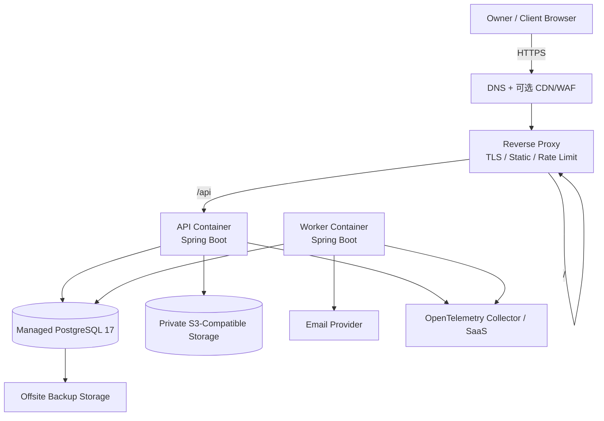

# 《MilestoneFlow Pilot MVP V0.1 部署架构设计》

## 1. 文档信息

| 字段 | 内容 |
|---|---|
| 文档编号 | MF-DEPLOY-001 |
| 版本 | V0.1 |
| 目标 | 定义开发、测试、预发布、Pilot 生产拓扑和运维边界 |

## 2. 部署原则

1. Pilot 优先可靠、可恢复和低运维成本，不采用 Kubernetes。
2. 前端、API、Worker 使用容器化构建，数据库和对象存储优先使用托管服务。
3. 生产数据库不得与应用容器生命周期绑定。
4. 邮件、对象存储和监控均通过适配器隔离供应商。
5. 所有环境独立数据库、对象桶、Cookie 名称、域名和密钥。
6. 部署必须可回滚，数据库迁移必须向前兼容至少一个应用版本。

## 3. 环境划分

| 环境 | 用途 | 数据要求 | 外部邮件 |
|---|---|---|---|
| Local | 单人开发 | Docker 本地测试数据 | Mailpit/Mock |
| CI | 自动测试 | 临时 Testcontainers | 禁止真实发送 |
| Dev | 集成开发 | 独立非生产数据 | Sandbox |
| Staging | 发布验收、迁移演练 | 脱敏/构造数据 | Sandbox 或白名单 |
| Production | 真实 Pilot | 真实业务数据 | 正式供应商 |

严禁复制生产数据库到开发环境。需要排障时使用脱敏导出或最小复现数据。

## 4. Pilot 推荐拓扑



### 4.1 单应用主机

应用主机运行：

- Reverse Proxy；
- 前端静态资源；
- 1 个 API 容器；
- 1 个 Worker 容器；
- 可选 OpenTelemetry Collector Agent。

PostgreSQL、对象存储和备份放在主机外，避免单机磁盘故障同时丢失应用和数据。

### 4.2 最低资源建议

Pilot 初始应用主机：

- 2 vCPU；
- 4 GB RAM；
- 40 GB 系统盘；
- 仅保存容器、短期日志和临时文件；
- 不保存唯一业务数据副本。

实际资源以压测结果调整，不将此数值视为容量承诺。

## 5. 容器与网络

### 5.1 服务

```yaml
services:
  reverse-proxy:
  api:
  worker:
  otel-collector: # 可选
```

生产 Compose 不包含 PostgreSQL 和对象存储；Local Compose 可包含 PostgreSQL、MinIO 和 Mailpit。

### 5.2 网络边界

- 只有 Reverse Proxy 暴露 80/443。
- API 仅在私有容器网络监听。
- Worker 不暴露 HTTP 业务端口，仅保留内部健康检查。
- 数据库仅允许应用主机或私有网络连接。
- 对象存储桶完全私有。
- Actuator 管理端点不经公网暴露，或使用独立管理端口与网络白名单。

## 6. 域名与路由

建议同源部署：

```text
https://app.example.com/                  Vue SPA
https://app.example.com/api/v1/...        内部 API
https://app.example.com/public/...        公开页面壳
https://app.example.com/api/v1/public/... 公开 API
```

同源降低 Cookie、CORS 和 CSRF 复杂度。公开页面与管理端可共享域名，但使用独立布局、CSP 路径策略和缓存策略。

## 7. 构建与发布流水线

```mermaid
flowchart LR
    Commit --> Lint[Lint / Format / Static Analysis]
    Lint --> Unit[Unit Tests]
    Unit --> Module[Module Boundary Tests]
    Module --> IT[Testcontainers Integration Tests]
    IT --> FE[Frontend Unit + Build]
    FE --> E2E[Playwright E2E]
    E2E --> Scan[Dependency / Image Scan]
    Scan --> Image[Build Immutable Images]
    Image --> Stage[Deploy Staging]
    Stage --> Smoke[Migration + Smoke + Security Checks]
    Smoke --> Approve[Manual Production Approval]
    Approve --> Prod[Rolling/Replace Deploy]
```



### 7.1 构建产物

- `milestoneflow-backend:<git-sha>`：API 和 Worker 共用镜像；
- `milestoneflow-web:<git-sha>`：静态资源镜像或归档；
- `openapi.yaml`：与版本绑定；
- Flyway Migration：包含在后端镜像；
- SBOM 与依赖扫描报告；
- 变更日志和回滚说明。

禁止使用 `latest` 作为唯一生产版本标签。

## 8. 数据库迁移策略

### 8.1 原则

- 使用 Flyway，迁移文件只追加不修改已执行版本。
- 应用启动不自动执行危险迁移；生产由发布步骤显式执行。
- 采用 Expand → Migrate → Contract：
  1. 先添加兼容字段/表；
  2. 发布同时兼容新旧结构的应用；
  3. 后台回填；
  4. 验证后再删除旧结构。

### 8.2 发布前检查

- 在 Staging 的生产同版本 PostgreSQL 执行迁移；
- 记录执行时长和锁影响；
- 大表 DDL 必须评审；
- 迁移失败不启动新应用；
- 备份恢复点已创建。

## 9. 备份与恢复

### 9.1 数据库

- 托管 PostgreSQL 开启自动备份和时间点恢复；
- 每日逻辑备份或快照复制到独立备份位置；
- 备份保留策略建议：每日 14 份、每周 8 份、每月 6 份；
- 至少每月执行一次恢复演练到隔离环境。

### 9.2 对象存储

- 开启对象版本控制或等效保护；
- 历史交付引用文件禁止生命周期规则提前删除；
- 数据库备份与对象存储清单在同一恢复演练中校验。

### 9.3 目标

Pilot 初始目标：

- RPO ≤ 24 小时；优先依赖托管数据库 PITR 将实际 RPO 降至分钟级；
- RTO ≤ 4 小时；
- 数据丢失发布门禁为 0。

## 10. 高可用与故障处理

V0.1 目标可用性 99.5%，采用“可快速恢复”而非全套多区域高可用。

| 故障 | 处理 |
|---|---|
| API 容器崩溃 | 自动重启，健康检查摘除 |
| Worker 崩溃 | 任务保留在数据库，重启后继续 |
| 邮件供应商失败 | 指数退避，永久失败可复制链接 |
| 对象存储暂时失败 | 上传/下载明确失败，不影响其他业务记录 |
| 数据库不可用 | API 快速失败并告警，不接受部分成功 |
| 应用主机故障 | 在新主机拉取同版本镜像和配置恢复 |
| 错误发布 | 回滚应用镜像；数据库使用兼容迁移，不直接回滚破坏性 DDL |

## 11. Worker 任务领取

多 Worker 时使用 PostgreSQL `FOR UPDATE SKIP LOCKED` 或等效租约：

```text
PENDING/RETRY
→ 事务领取，写 locked_by、locked_until
→ 执行
→ COMPLETED / RETRY / FAILED
```

任务必须幂等；超过 `locked_until` 的任务可被重新领取。不要依赖单机内存队列保存唯一任务状态。

## 12. 配置与密钥

### 12.1 配置层级

1. 代码默认值；
2. 环境 Profile 配置；
3. 环境变量；
4. Secret Manager/部署密钥文件。

### 12.2 规则

- `.env` 只允许本地开发，不提交生产值。
- 密钥不进入 Git、镜像层、日志、错误追踪标签或前端环境变量。
- 前端 `VITE_*` 全部视为公开信息。
- Cookie 签名密钥、Provider Key、数据库密码必须可轮换。
- 生产启动时校验必需配置，缺失则 Fail Fast。

## 13. 健康检查

| 端点 | 含义 |
|---|---|
| Liveness | 进程是否应重启，不依赖外部服务 |
| Readiness | 数据库连接、迁移版本、必要配置是否可服务 |
| Worker Health | 最近领取/完成任务时间、失败积压 |

对象存储和邮件供应商不应让 API Liveness 失败；它们通过依赖指标和专门告警反映。

## 14. 监控与告警

### 14.1 必须监控

- API 请求量、P50/P95/P99、4xx/5xx；
- 数据库连接池、慢查询、锁等待；
- Worker 待处理数、最老任务年龄、失败数；
- 邮件成功率和永久失败；
- 公开链接无效/限流/越权尝试；
- 文件上传失败和未完成意图；
- 核心业务事件成功数；
- 磁盘、CPU、内存、容器重启。

### 14.2 初始告警

- 5 分钟 API 5xx > 2%；
- P95 连续 10 分钟 > 500ms；
- 最老邮件任务 > 10 分钟；
- 数据库连接池使用率 > 80%；
- 公开链接猜测/限流异常突增；
- 备份失败；
- 恢复演练逾期。

阈值在 Pilot 流量形成后调整。

## 15. 回滚方案

### 15.1 应用回滚

- 保留最近至少 5 个不可变镜像；
- Reverse Proxy 切回上一稳定容器；
- 回滚后执行关键 Smoke Test；
- Worker 与 API 版本必须满足事件/数据库兼容矩阵。

### 15.2 数据库

数据库不依赖“向下迁移脚本”作为主要回滚手段。若错误迁移已破坏数据，使用 PITR/备份恢复并执行事件对账。破坏性迁移必须延迟到新版本稳定后。

## 16. 灾难恢复运行手册摘要

1. 宣布事故并冻结写入；
2. 确认最近可用数据库恢复点；
3. 在隔离环境恢复数据库；
4. 校验 Flyway 版本、关键表数量、对象引用和审计连续性；
5. 部署匹配镜像；
6. 切换域名/连接；
7. 执行 E2E Smoke；
8. 恢复写入并持续监控；
9. 输出事故报告和数据影响说明。

## 17. 部署验收清单

- [ ] HTTPS 与证书自动续期有效。
- [ ] HTTP 自动跳转 HTTPS。
- [ ] 数据库不暴露公网。
- [ ] 对象桶私有且下载地址短时有效。
- [ ] 生产 Cookie Secure/HttpOnly/SameSite 正确。
- [ ] 管理端点不公开。
- [ ] 备份、恢复和回滚已演练。
- [ ] 日志中无完整令牌、Cookie、密钥和预签名 URL。
- [ ] API 与 Worker 可独立重启。
- [ ] 邮件失败不会改变业务事务结果。
