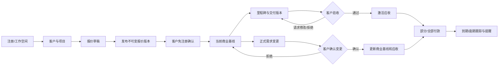
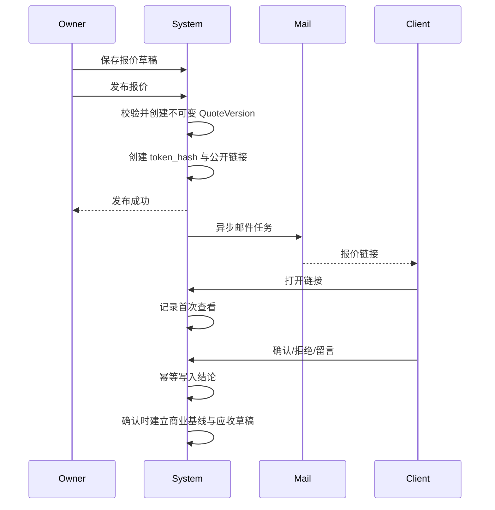
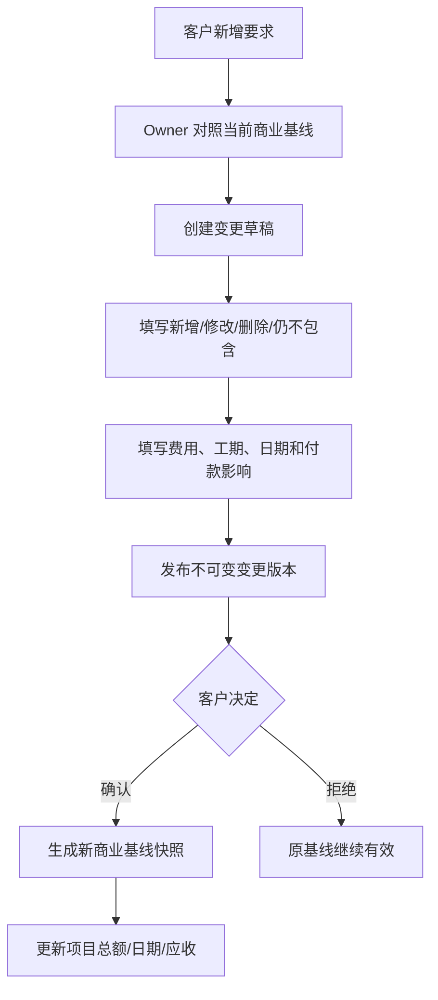

# 《MilestoneFlow Pilot MVP V0.1 核心业务流程说明》

## 1. 角色

- **Owner：** 唯一内部操作人。
- **Client：** 无需注册，通过单对象安全链接操作。
- **System Job：** 处理逾期计算、邮件发送和重试。

## 2. 总体用户旅程

## 3. 流程 A：注册、客户与项目启动

### 正常流程

1. Owner 注册并验证邮箱。
2. Owner 创建工作空间，设置默认币种和时区。
3. Owner 创建客户和主要联系人。
4. Owner 为活跃客户创建项目。
5. 项目以 `DRAFT` 状态进入项目列表。

### 完成条件

- Owner 可进入工作台。
- 工作空间租户边界已建立。
- 客户与项目属于同一 workspace。
- 项目尚未产生商业基线。

### 异常流程

| 编号 | 场景 | 处理 |
|---|---|---|
| EX-A01 | 邮箱重复或密码过弱 | 拒绝注册，显示字段错误 |
| EX-A02 | 邮箱未验证即发送客户链接 | 阻止发送，引导验证邮箱 |
| EX-A03 | 客户已归档 | 禁止创建新项目 |
| EX-A04 | 跨 workspace 对象 ID | 统一拒绝，不泄露对象存在性 |
| EX-A05 | 重复创建请求 | 使用幂等键避免重复客户或项目 |

## 4. 流程 B：报价发布与客户确认

### 正常流程

1. Owner 编辑项目背景、工作范围、非工作范围、交付物、验收标准、金额、付款计划和有效期。
2. 系统验证范围、金额、币种、付款计划合计和日期。
3. 发布生成不可变报价版本和公开链接。
4. 邮件异步发送；Owner 可直接复制链接。
5. Client 打开链接，无需注册。
6. Client 查看版本和确认后果。
7. Client 确认、拒绝或留言。
8. 确认后项目建立首个当前商业基线，并按付款计划创建应收草稿。

### 异常流程

| 编号 | 场景 | 处理 |
|---|---|---|
| EX-B01 | 工作范围为空/金额错误 | 阻止发布 |
| EX-B02 | 新版本替代旧版本 | 旧链接只读并提示已更新 |
| EX-B03 | 报价过期或撤销 | 统一失效页，不展示敏感信息 |
| EX-B04 | 客户重复确认 | 返回相同结果，不重复建基线/应收 |
| EX-B05 | 邮件失败 | 报价仍发布成功，允许重试和复制链接 |
| EX-B06 | 客户网络中断后重试 | Idempotency-Key 返回已处理结果 |

## 5. 流程 C：交付版本与客户验收

### 正常流程

1. Owner 创建并启动里程碑。
2. Owner填写交付说明、外部链接并上传交付文件。
3. 系统验证文件上传完成和访问权限。
4. Owner 提交交付，系统生成不可变 DeliveryVersion。
5. 里程碑进入 `PENDING_ACCEPTANCE`。
6. Client 打开验收链接，查看版本、文件和验收标准。
7. Client 选择：
   - 通过：里程碑 `ACCEPTED`，激活关联应收；
   - 请求修改：记录反馈，里程碑 `REVISION_REQUIRED`；
   - 拒绝：记录严重原因，进入修改处理。
8. Owner 完成修改后创建新交付版本，不覆盖旧版本。

### 异常流程

| 编号 | 场景 | 处理 |
|---|---|---|
| EX-C01 | 文件上传未完成 | 阻止提交 |
| EX-C02 | 反馈为空 | 请求修改/拒绝不允许提交 |
| EX-C03 | 已验收后再次提交结论 | 幂等返回，不改变结论 |
| EX-C04 | V1 被 V2 替代 | V1 链接只读 |
| EX-C05 | 并发通过与请求修改 | 仅首个合法事务成功，后续返回冲突 |
| EX-C06 | 邮件失败 | 交付版本和待验收状态保持有效 |

## 6. 流程 D：正式需求变更

### 关键规则

- 变更确认前不得开始自动更新项目金额、日期或应收。
- “费用不变”和“工期不变”也要显式记录，不能留空。
- 客户确认时必须看到变更原因、范围差异和商业影响。
- 变更确认后一次性更新商业基线，重复请求不得重复增加金额。

### 异常流程

| 编号 | 场景 | 处理 |
|---|---|---|
| EX-D01 | 项目没有已确认基线 | 禁止发布正式变更 |
| EX-D02 | 金额/工期影响缺失 | 阻止发布 |
| EX-D03 | 客户拒绝 | 保留记录，原基线不变 |
| EX-D04 | 变更已过期/撤销 | 禁止操作 |
| EX-D05 | 并发确认 | 唯一约束和幂等保证仅一次生效 |
| EX-D06 | 基线更新部分失败 | 整个确认事务回滚 |

## 7. 流程 E：应收、付款与提醒

### 正常流程

1. 应收由报价付款计划、里程碑验收或变更确认创建/激活。
2. System Job 按工作空间时区判断到期和逾期。
3. Owner 在应收看板查看来源、金额、已收、未收和逾期。
4. Owner 记录部分或全部付款。
5. 后端重新计算余额和状态。
6. 即将到期或逾期时，Owner 预览提醒并手工发送。
7. 邮件任务异步执行；失败可重试。

### 异常流程

| 编号 | 场景 | 处理 |
|---|---|---|
| EX-E01 | 金额小于等于 0 | 拒绝付款记录 |
| EX-E02 | 超额付款 | 二次确认并记录超额 |
| EX-E03 | 重复付款请求 | 只创建一条记录 |
| EX-E04 | 错误付款记录 | 通过作废并保留原因，不无痕删除 |
| EX-E05 | 同一提醒重复发送 | 幂等去重 |
| EX-E06 | 邮件永久失败 | 显示失败，允许人工复制内容继续 |
| EX-E07 | 工作空间时区跨日 | 以工作空间时区判断到期 |

## 8. 流程 F：归档与只读

1. Owner 可归档客户或项目。
2. 归档客户不能新建项目。
3. 归档项目不能新增报价、交付、变更、应收、付款或提醒。
4. 历史版本、文件、应收和审计仍可授权查看。
5. 所有归档动作进入审计时间线。

## 9. 通用一致性原则

- **事务：** 状态变化、基线、应收和审计中需要强一致的部分在同一数据库事务。
- **异步：** 邮件和非关键通知在业务事务后处理。
- **幂等：** 报价确认、验收、变更确认、付款记录和提醒必须幂等。
- **并发：** 使用版本号/乐观锁和唯一约束防止覆盖。
- **权限：** 前端隐藏不构成授权，后端必须验证工作空间或公开链接范围。
- **版本：** 已发布内容不允许更新，只能创建新版本。
- **信息最小化：** 无效公开链接不返回客户、项目、金额或文件信息。
