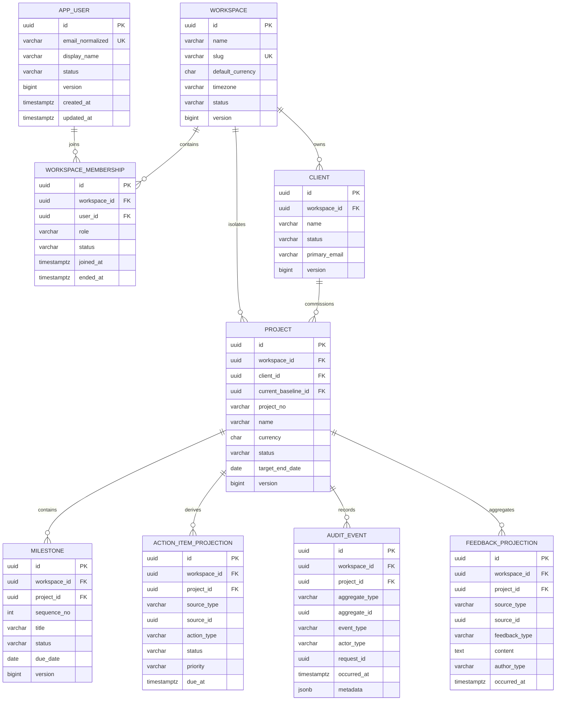
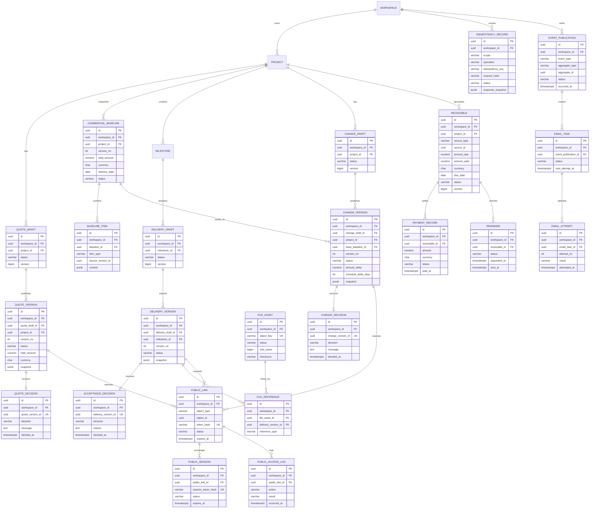

# 《MilestoneFlow Pilot MVP V0.1 ER 图》

## 1. 图例

- `||--o{`：一对多。
- `||--o|`：一对零或一。
- 标注 `projection` 的表为可重建读模型，不是商业事实唯一来源。
- 所有租户业务关系在物理数据库中同时使用 `workspace_id` 组合外键；图中为可读性省略部分重复连线。

## 2. 核心实体 ER 图



## 3. 商业闭环扩展 ER 图



## 4. 组合外键示例

```sql
ALTER TABLE milestone
  ADD CONSTRAINT fk_milestone_project_workspace
  FOREIGN KEY (workspace_id, project_id)
  REFERENCES project (workspace_id, id);

ALTER TABLE delivery_version
  ADD CONSTRAINT fk_delivery_version_milestone_workspace
  FOREIGN KEY (workspace_id, milestone_id)
  REFERENCES milestone (workspace_id, id);
```

## 5. 图模型说明

1. User 是全局身份；WorkspaceMember 决定用户在哪个租户中拥有什么角色。
2. Project 是商业闭环主容器，但报价、基线、交付、变更、应收分别拥有自己的聚合和状态机。
3. Project 的 `current_baseline_id` 是便捷指针，CommercialBaseline 历史链仍完整保留。
4. Task 和 Feedback 是可重建投影，ActivityLog 是不可变事实记录。
5. 所有公开链接绑定单一版本对象；文件公开下载必须通过 DeliveryVersion 的 FileReference 验证。
