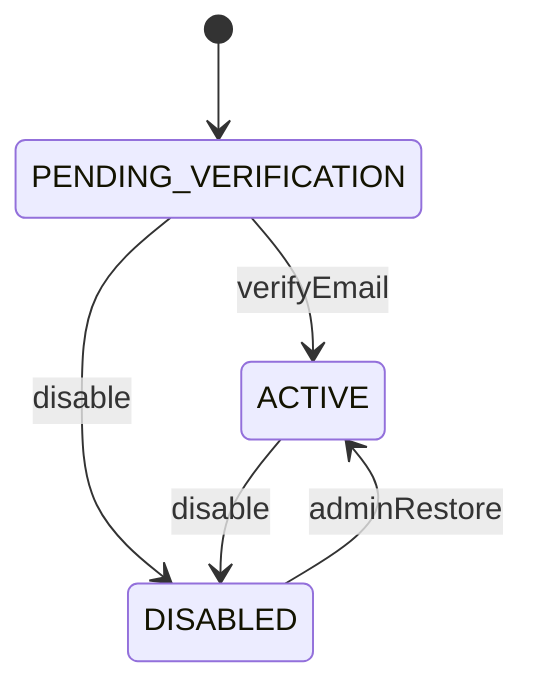
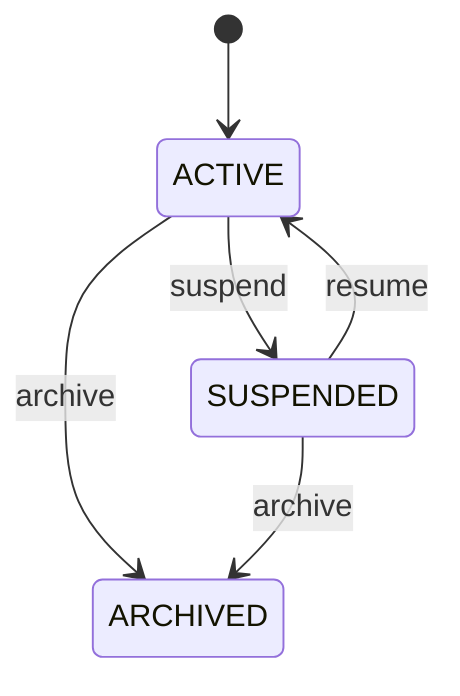
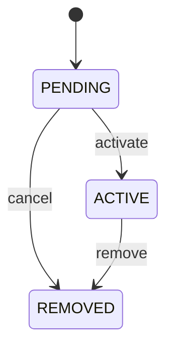
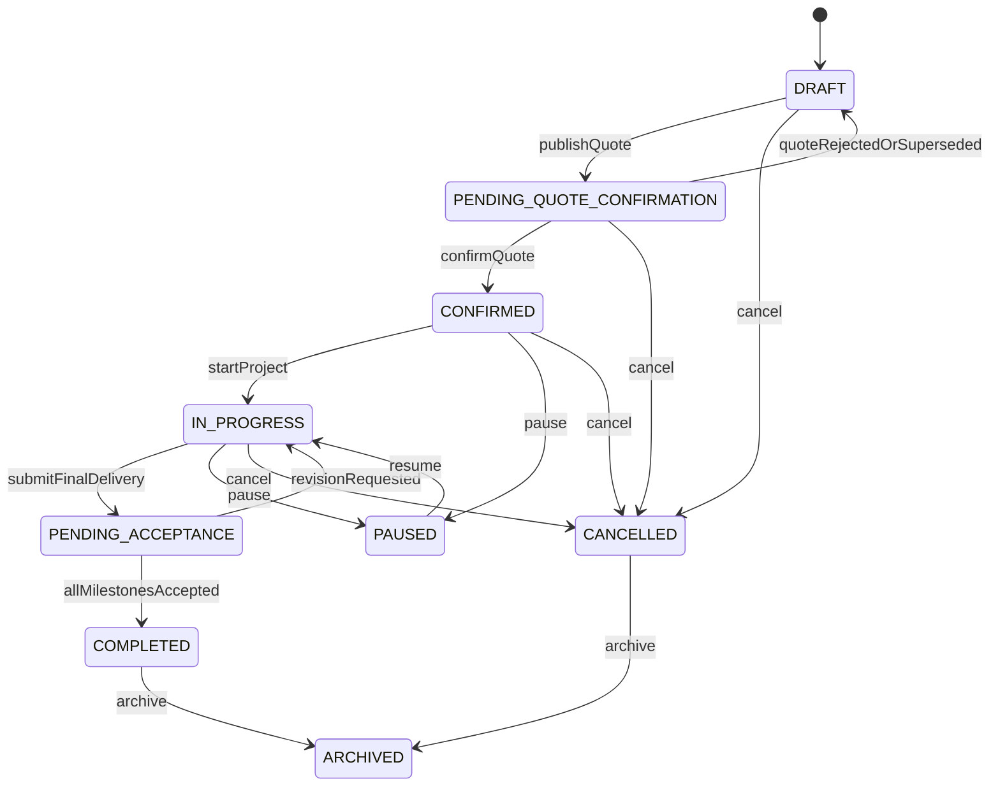
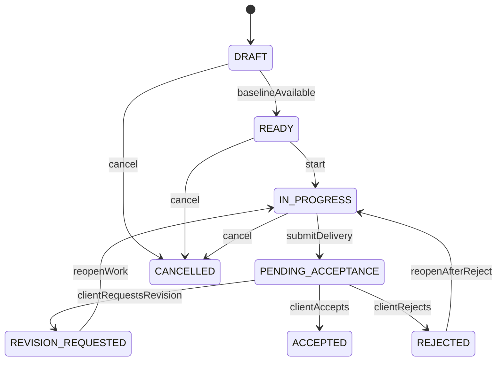
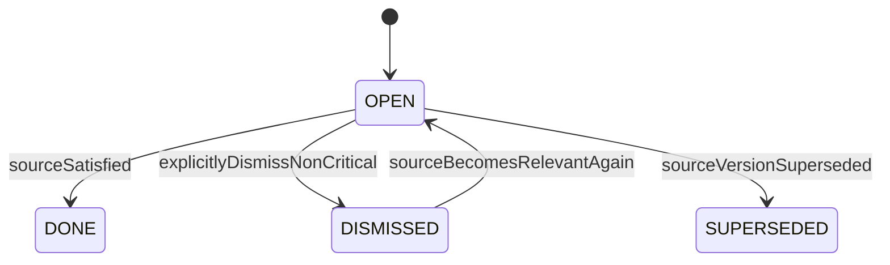
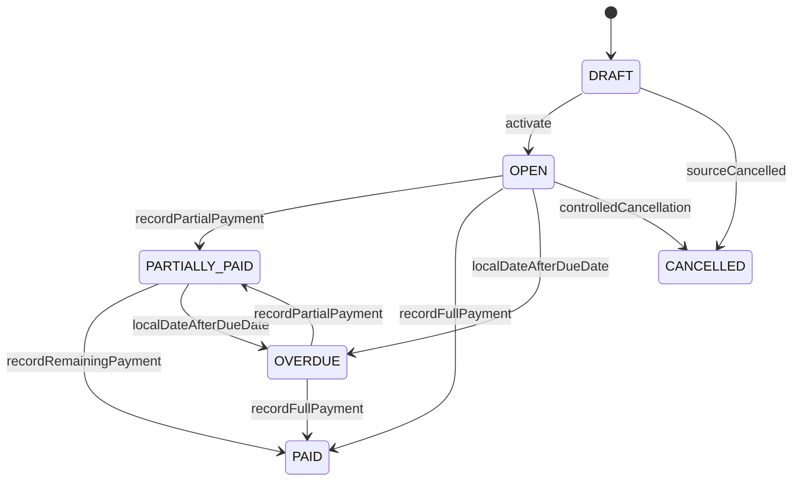

# 《MilestoneFlow Pilot MVP V0.1 状态机与枚举说明》

## 1. 设计规则

1. 状态变更只能通过领域方法或明确动作 API，不提供通用 `status` PATCH。
2. Java 使用字符串枚举，数据库使用 `varchar + CHECK`；新增枚举值必须先兼容数据库与旧应用。
3. 终态记录禁止回退；需要修正时创建新版本、撤销、替代或补偿记录。
4. 每个状态机必须测试所有合法边与关键非法边。

## 2. User 状态机



| 状态 | 含义 |
|---|---|
| PENDING_VERIFICATION | 已注册但邮箱未验证，权限受限 |
| ACTIVE | 正常账号 |
| DISABLED | 禁止登录，相关会话撤销 |

## 3. Workspace 状态机



`ARCHIVED` 为终态；历史只读。

## 4. WorkspaceMember 状态机



V0.1 创建 Owner 时可直接进入 ACTIVE。

## 5. Project 状态机



关键规则：

- `ARCHIVED` 不允许任何业务写操作。
- `CONFIRMED` 必须存在当前商业基线。
- 进入 `COMPLETED` 必须满足所有必需里程碑已验收且无阻断事项。

## 6. Milestone 状态机



`ACCEPTED` 与 `CANCELLED` 为终态。是否允许 REJECTED 直接终止项目由 Project 规则决定；V0.1 默认允许重新进入 IN_PROGRESS 创建新交付版本。

## 7. Task / ActionItem 状态机



商业关键行动项（待确认、待验收、已逾期）不能仅通过用户点击关闭，必须由源状态满足后转为 DONE。

## 8. 报价、交付、变更版本状态

### 8.1 QuoteVersion

```text
PUBLISHED → CONFIRMED
PUBLISHED → REJECTED
PUBLISHED → REVOKED
PUBLISHED → EXPIRED
PUBLISHED → SUPERSEDED
```

这些状态均不修改发布正文。QuoteDecision 对同一 QuoteVersion 唯一。

### 8.2 DeliveryVersion

```text
SUBMITTED → ACCEPTED
SUBMITTED → REVISION_REQUESTED
SUBMITTED → REJECTED
SUBMITTED → SUPERSEDED
SUBMITTED → REVOKED
```

新交付版本提交后，旧待处理版本转为 SUPERSEDED。

### 8.3 ChangeVersion

```text
PUBLISHED → CONFIRMED
PUBLISHED → REJECTED
PUBLISHED → REVOKED
PUBLISHED → EXPIRED
PUBLISHED → SUPERSEDED
```

确认前必须校验 `base_baseline_id` 仍是当前基线，否则不转换并返回基线过期冲突。

## 9. Receivable 状态机



PaymentRecord 状态：`RECORDED → VOIDED`。作废后重新计算 Receivable；付款记录不删除。

## 10. PublicLink 与 PublicSession 状态

| 对象 | 状态 | 转换 |
|---|---|---|
| PublicLink | ACTIVE | 初始可用 |
| PublicLink | REVOKED | Owner 撤销，终态 |
| PublicLink | EXPIRED | 到期扫描或访问时惰性计算，终态 |
| PublicLink | SUPERSEDED | 新版本替代，终态 |
| PublicSession | ACTIVE | Token Exchange 成功 |
| PublicSession | EXPIRED | 到期 |
| PublicSession | REVOKED | Link 撤销、退出或安全事件 |

## 11. 文件与异步任务状态

### 11.1 FileAsset

```text
PENDING_UPLOAD → UPLOADED → AVAILABLE
PENDING_UPLOAD/UPLOADED → FAILED
AVAILABLE → QUARANTINED
AVAILABLE → DELETED（仅无任何历史引用时）
```

### 11.2 EventPublication / EmailTask

```text
PENDING → PROCESSING → COMPLETED
PROCESSING → RETRY → PROCESSING
PROCESSING/RETRY → FAILED
```

Worker 领取时使用租约；租约过期的 PROCESSING 可重新领取。消费者必须幂等。

## 12. 枚举总表

### 12.1 身份与租户

| 枚举 | 值 |
|---|---|
| UserStatus | PENDING_VERIFICATION, ACTIVE, DISABLED |
| WorkspaceStatus | ACTIVE, SUSPENDED, ARCHIVED |
| WorkspaceRole | OWNER, ADMIN, MEMBER, VIEWER |
| MembershipStatus | PENDING, ACTIVE, REMOVED |

### 12.2 项目与交付

| 枚举 | 值 |
|---|---|
| ProjectStatus | DRAFT, PENDING_QUOTE_CONFIRMATION, CONFIRMED, IN_PROGRESS, PENDING_ACCEPTANCE, COMPLETED, PAUSED, CANCELLED, ARCHIVED |
| MilestoneStatus | DRAFT, READY, IN_PROGRESS, PENDING_ACCEPTANCE, REVISION_REQUESTED, ACCEPTED, REJECTED, CANCELLED |
| VersionStatus | PUBLISHED/SUBMITTED, CONFIRMED/ACCEPTED, REJECTED, REVISION_REQUESTED, REVOKED, EXPIRED, SUPERSEDED |
| DecisionType | CONFIRMED, ACCEPTED, REJECTED, REVISION_REQUESTED |

实现时建议为 Quote、Delivery、Change 分别定义枚举，避免使用一个语义过宽的 VersionStatus。

### 12.3 ActionCenter 与 Feedback

| 枚举 | 值 |
|---|---|
| ActionItemStatus | OPEN, DONE, DISMISSED, SUPERSEDED |
| ActionPriority | LOW, MEDIUM, HIGH, CRITICAL |
| ActionType | SEND_QUOTE, WAIT_QUOTE_CONFIRMATION, SUBMIT_DELIVERY, WAIT_ACCEPTANCE, WAIT_CHANGE_CONFIRMATION, PAYMENT_DUE_SOON, PAYMENT_DUE, PAYMENT_OVERDUE, EMAIL_FAILURE |
| ActionSourceType | QUOTE_VERSION, MILESTONE, DELIVERY_VERSION, CHANGE_VERSION, RECEIVABLE, EMAIL_TASK |
| FeedbackType | QUOTE_MESSAGE, QUOTE_REJECTION, DELIVERY_REVISION_REQUEST, DELIVERY_REJECTION, CHANGE_MESSAGE, CHANGE_REJECTION |
| FeedbackSourceType | QUOTE_DECISION, ACCEPTANCE_DECISION, CHANGE_DECISION |
| ActorType | USER, CLIENT, SYSTEM, JOB |

### 12.4 商业与基础设施

| 枚举 | 值 |
|---|---|
| ReceivableStatus | DRAFT, OPEN, PARTIALLY_PAID, PAID, OVERDUE, CANCELLED |
| PaymentStatus | RECORDED, VOIDED |
| ReminderStatus | PENDING, QUEUED, SENT, FAILED, CANCELLED |
| PublicLinkStatus | ACTIVE, REVOKED, EXPIRED, SUPERSEDED |
| FileStatus | PENDING_UPLOAD, UPLOADED, AVAILABLE, FAILED, QUARANTINED, DELETED |
| AsyncStatus | PENDING, PROCESSING, RETRY, COMPLETED, FAILED |
| IdempotencyStatus | PROCESSING, COMPLETED, FAILED |
| AuditSource | API, PUBLIC, WORKER, MIGRATION |

## 13. 数据库 CHECK 与演进

- 每个枚举列建立 CHECK，例如 `status IN (...)`。
- 增加枚举值时先发布只扩展 CHECK 的迁移，再发布能够写新值的应用。
- 删除枚举值需要先停止写入、迁移历史值、发布兼容应用，最后收紧 CHECK。
- 枚举语义变更属于领域兼容性变更，必须回写文档和 OpenAPI。
